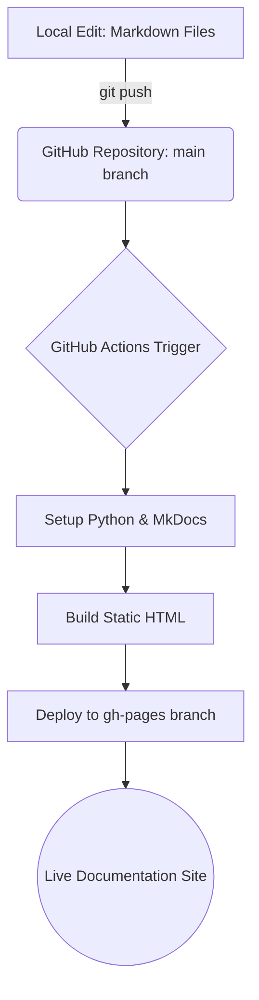

# Documentation Deployment Flow

เอกสารชุดนี้ใช้ **MkDocs** พร้อมธีม **Material** และถูกจัดส่ง (Deploy) แบบอัตโนมัติผ่าน **GitHub Actions** ไปยัง **GitHub Pages**

## CI/CD Workflow Diagram

---

## 🚀 How it Works

### 1. การแก้ไขเอกสาร (Authoring)
นักเขียนหรือนักพัฒนาทำการแก้ไขไฟล์ `.md` ภายในโฟลเดอร์ `docs/` บนเครื่องตนเอง หรือแก้ไขผ่านหน้าเว็บ GitHub โดยตรง

### 2. การผลักดันข้อมูล (Pushing)
เมื่อทำการ `git push` ไปยังกิ่ง (branch) `main` ระบบอัตโนมัติจะเริ่มทำงานทันที

### 3. ระบบอัตโนมัติ (GitHub Actions)
ไฟล์ตั้งค่าอยู่ที่ `.github/workflows/deploy-docs.yml` ซึ่งจะทำหน้าที่:
- ตรวจสอบ Code ล่าสุดออกไป
- ติดตั้ง Python และไลบรารี `mkdocs-material`
- รันคำสั่ง `mkdocs gh-deploy` เพื่อสร้างไฟล์ HTML และผลักไปที่กิ่ง `gh-pages`

### 4. การเผยแพร่ (Publishing)
GitHub Pages จะรับไฟล์จากกิ่ง `gh-pages` มาแสดงผลที่ URL:
`https://gridsmicro.github.io/smartfarm-docs/`

---

## 🛠️ การตั้งค่าครั้งแรก (One-time Setup)

หากคุณนำโค้ดนี้ไปรันใน Repository ใหม่ ต้องมั่นใจว่ามีการตั้งค่าดังนี้:

1.  **Repository Settings**: ไปที่ `Settings` > `Actions` > `General`
2.  **Workflow Permissions**: เลือก **"Read and write permissions"** เพื่อให้ Action สามารถสร้างกิ่ง `gh-pages` ได้
3.  **Pages Settings**: ไปที่ `Settings` > `Pages`
    - Build and deployment > Source: **Deploy from a branch**
    - Branch: **gh-pages** / Folder: **/(root)**

---

## 💡 Tips
- คุณสามารถรันดูผลลัพธ์ในเครื่องก่อนได้ด้วยคำสั่ง `mkdocs serve`
- หาก Build พัง สามารถตรวจสอบ Log ได้ที่แถบ **Actions** ใน GitHub
